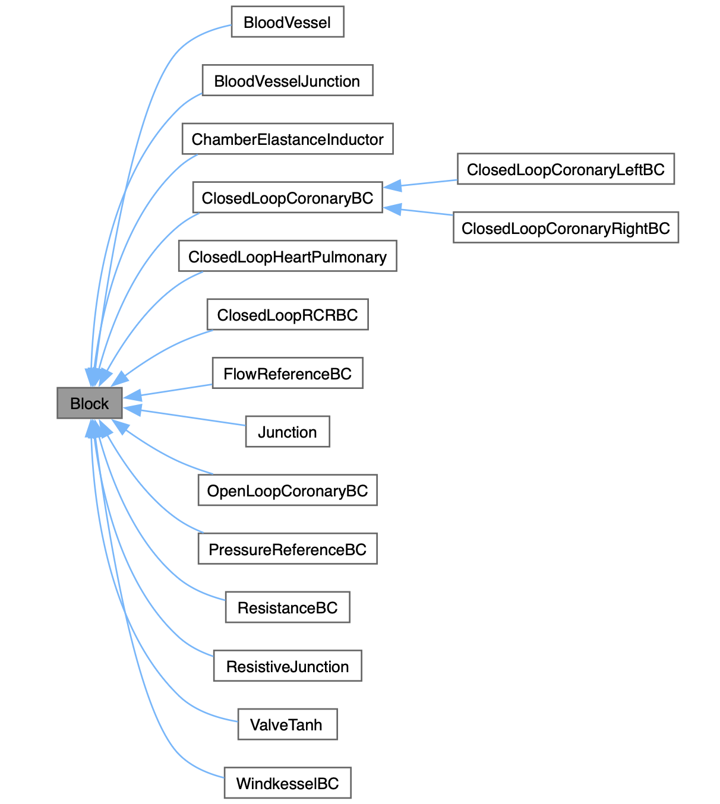

# Summary

Computational modeling of cardiovascular blood flow has emerged as a valuable tool in the diagnosis and treatment of cardiovascular disease [@menon2024cardiovascular]. 

While simulations of blood flow can be performed using various high and low-fidelity techniques, lumped-parameter or zero-dimensional modeling is a low-order technique that is widely used in various applications that require quick estimation of bulk flow quantities, such as flow and pressure at specific anatomical locations.

We introduce `svZeroDSolver`, an efficient and modular package for performing lumped-parameter (zero-dimensional) simulations of cardiovascular blood flow. `svZeroDSolver` is written in C++ using an object-oriented framework. It designed so that a user can simply specify a `.json` dictionary of "blocks", such as blood vessels, valves, heart chambers, junctions between blood vessels, and boundary conditions (along with their associated parameters), and the code automatically assembles and solves the governing equations corresponding to the user-specified vascular model. The package also includes Python and C++ APIs to facilitate its use with other Python packages, for example in optimization and uncertainty quantification applications, as well as allows interfacing with other high-performance C++/Fortran software, which is useful when using lumped-parameter boundary conditions for high-fidelity simulations. Finally, it includes an application, `svZeroDCalibrator`, to calibrate parameters of a given zero-dimensional model based on independent measurements of hemodynamics at specific anatomical locations.

# Statement of need

The ability to non-invasively quantify patient-specific hemodynamics via computational simulations has been shown to improve patient outcomes and reduce invasive clinical procedures in large randomized clinical trials [@TAYLOR2023]. 
Computational modeling is also a promising tool for non-invasive and personalized optimization of clinical treatments and surgery [@Marsden2014]. 

Previous work has used a variety of techniques to model cardiovascular blood flow, all of which can be broadly categorized based on their level of fidelity. 
High-fidelity models generally involve simulations of the full three-dimensional flow-field within anatomical regions of interest [@Updegrove2017]. 
While these are the most accurate and informative, they are computationally expensive (each simulation can take several hours or days on hundreds of CPU cores) and therefore not feasible for use within typical clinical settings or for applications such as optimization that typically require thousands of evaluations. 
On the other end of the spectrum, lumped-parameter or zero-dimensional models provide information about bulk hemodynamics, such as flow rate and pressure, at specific anatomical regions of interest. 
While these models are not spatially-resolved, they are very valuable in applications that require near real-time quantification of bulk hemodynamics, as well as applications that rely on thousands of repeated evaluations, such as optimization and uncertainty quantification. 
They are also used in conjunction with high-fidelity simulations where lumped-parameter models are used as boundary conditions [@menon2024personalized;@ZANONI2024;@richter2024bayesian].

`svZeroDSolver` is a new open-source software package that enables fast evaluation of zero-dimensional hemodynamics. 
One specific challenge in zero-dimensional modeling that `svZeroDSolver` addresses is that different clinical applications (and individual clinical cases within the same application) often require unique anatomical arrangements of blood vessels, heart valves, etc., and each of these anatomical configurations is governed by a distinct set of differential equations. 
It is therefore common for users to implement application-specific solvers, which simulate the equations governing a specific application or anatomical configuration. 
In contrast, the modularity of `svZeroDSolver` allows users to easily create arbitrary anatomical configurations by arranging a library of available "blocks", following which the software automatically assembles the equations governing the specified confguration. 
Another unique feature of `svZeroDSolver` is its ability to easily interface with other C++ and Python packages. 
This has been used in previous work on uncertainty quantification [@richter2024bayesian;@Lee2024;ZANONI2024] as well as in multi-scale simulations coupling three-dimensional hemodynamics with zero-dimensional representations of downstream circulation [@menon2023predictors;@menon2024personalized]. 
In addition, the `svZeroDCalibrator` application within `svZeroDSolver` includes functionality to improve the accuracy of zero-dimensional models by optimizing the parameters of blood vessels to recapitulate observed hemodynamics from measurements or high-fidelity simulations.  
This allows users to build more accurate zero-dimensional models than those typically based on purely the anatomy of the vascular region of interest [@richter2024bayesian].
The accuracy of `svZeroDSolver` is assessed using continuous integration tests and has also been verified by comparing with high-fidelity three dimensional simulations [@pfaller2022].
This combination of features makes `svZeroDSolver` uniquely applicable to a wide range of applications in cardiovascular biomechanics. 

# Software implementation

{ width=80% }

`svZeroDSolver` relies on a collection of "blocks" to set up the governing equations for a given anatomical configuration. 
Each block is inherited from a `block` class, as illustrated in \autoref{fig:blocks}, and is governed by a "local" set of equations with associated degrees-of-freedom. 
The solver parses through an input configuration `.json` file, which lists the blocks, their parameters, and how they are connected to each other, and then automatically assembles the local equations and degrees-of-freedom for each block into a global system of equations.
The governing equations and circuit representation for each block are available in the documentation. For example, see the [documentation for a blood vessel block](https://simvascular.github.io/svZeroDSolver/class_blood_vessel.html#details). 

The zero-dimensional simulations performed by `svZeroDSolver` are governed by non-linear differential-algebraic equations. 
We integrate these equations in time using the implicit generalized-alpha scheme [@JANSEN2000305], with Newton-Raphson iterations to solve the linearized system.  
Under the hood, these linearized governing equations for each block are implemented as local contributions to a system of linear (matrix) equations, which are then assembled into a global linear system based on the user-specified configuration.
We use the Eigen package to represent and solve these sparse linear systems [@eigenweb].
Details of this implementation are provided in the [`SparseSystem`](https://simvascular.github.io/svZeroDSolver/class_sparse_system.html#details) and [`Integrator`](https://simvascular.github.io/svZeroDSolver/class_integrator.html#details) classes.

The input to `svZeroDSolver` is a `.json` file which specifies the simulation parameters (number of time steps, cardiac cycles, etc.), the types of blocks to be included in the specific model, the boundary conditions, and how the blocks are connected (typically using `junction` blocks). Each of these blocks requires several parameters which can generally be specified using a steady value, a list of time-varying values, or a mathematical function which is parsed using [exprtk](https://github.com/ArashPartow/exprtk). The solver can either run simulations for a specified number of time steps, or until the difference in mean quantities between consecutive cardiac cycles is below a given threshold. 

`svZeroDSolver` currently has implementations of different types of blood vessel blocks with non-linear resistors to model vascular stenoses, junctions between blood vessels, a heart valve block modeled using a hyperbolic tangent function, a cardiac chamber block modeled as a time-varying capacitor and inductor, and several different boundary condition blocks including simple flow, pressure or resistors blocks, windkessel boundary conditions, coronary boundary conditions that include the intramyocardial pressure experienced by coronary arteries, as well as closed-loop versions of windkessel and coronary boundary conditions that allow a user to build a closed-loop circulation model [@Kim2009;@kimcoronary;@menon2023predictors].
In addition, `svZeroDSolver` is integrated into the `Simvascular` project, which allows users to automatically generate zero-dimensional models from three-dimensional models using a graphical interface [@pfaller2022].
The development team actively implements new features, blocks and test cases to expand the capabilities of svZeroDSolver and ensure its accuracy and speed.  

# Acknowledgments

This work was supported by ???. Previous contributions to the software by Dr. Aekaansh Verma are acknowledged.

# References
